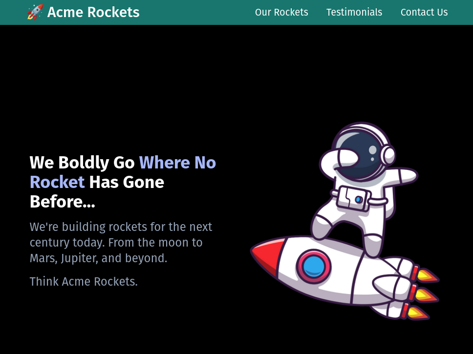

# Acme Rockets

Welcome to Acme Rockets repository! This project is a result of following an amazing [Tailwind CSS tutorial](https://www.youtube.com/watch?v=lCxcTsOHrjo&t=2s) on YouTube by Dave Gray. The goal of this tutorial was to learn and practice using TailwindCSS, a utility-first CSS framework for rapidly building custom user interfaces.

In this repository, you'll find the work from all five lessons of the tutorial, and you can also check the deployed final project at [Acme Rockets on Render.com](https://acme-rockets-pkc6.onrender.com/).



This README is aimed to be beginner-friendly to help you get started with the project and have a fantastic learning experience.

## Table of Contents

- [Getting Started](#getting-started)
  - [Prerequisites](#prerequisites)
  - [Installation](#installation)
- [Running the Project](#running-the-project)
- [Structure of the Repository](#structure-of-the-repository)
- [Resources](#resources)
- [Contributing](#contributing)
- [License](#license)
- [Support](#support)

## Getting Started

Follow these steps to set up the project locally.

### Prerequisites

Before getting started, make sure you have the following software installed on your system:

- [Node.js](https://nodejs.org/en/) 

This project was built using Node.js v16.16.0. If you use [NVM](https://github.com/nvm-sh/nvm), you can run `nvm use` to switch to the correct version.


### Installation

1. [Fork](https://docs.github.com/en/get-started/quickstart/fork-a-repo) and clone this repository:
```bash
git clone https://github.com/<your-username>/acme-rockets.git
```

2. Change the current directory to the project folder and in there to the Lesson folder you want to work with. Example:

```bash
cd acme-rockets/Lesson01
```
  To change into a different Lesson folder, just replace `Lesson01` with the folder name of the lesson you want to work on. Or, if you are inside a lesson folder, use the following command to change into a different lesson folder (replace `Lesson02` with the folder name of the lesson you want to work on):
``` bash
cd ../Lesson02
```

3. Install the dependencies:
```bash
npm ci 
```
These have to for each lesson, as the dependencies are not shared between them.

*Optional:*
For development, Light Server is used as a local server. It's installed via npm on a per-project basis (each lesson equals one project). But you can install it globally using npm if you prefer:

```bash
npm install -g light-server
```
## Running the Project

Start the development server:

```bash
npm run start 
```

Now, open your browser and navigate to [http://localhost:3000](http://localhost:3000) to view the project.

## Structure of the Repository

The main folders in this repository are:

- `Lesson01`: Contains the initial project set-up and a first TailwindCSS example with a Circle Drawing exercise. 
- `Lesson02`: Contains the start of the course project, Acme Rockets, including the header, the hero section, and product cards. 
- `Lesson03`: Introduces pseudo-classes and includes the contact form (front-end only) and the footer.
- `Lesson04_01`: Contains a simple animation for the mobile menu with a hamburger icon.
- `Lesson04_02`: Contains a more complex animation for the mobile menu with a div-based hamburger icon. 
- `Lesson05`: Contains the final version of the project that has been deployed to [Render.com](https://render.com/).

## Resources

- [Tailwind CSS Documentation](https://tailwindcss.com/docs)
- [Dave Gray's YouTube Channel](https://www.youtube.com/@DaveGrayTeachesCode)
- [Acme Rockets Deployed Project](https://acme-rockets-pkc6.onrender.com/#hero/)

## Contributing

Contributions are always welcome! If you'd like to contribute to this project or have any suggestions, feel free to create a new issue or submit a pull request. Please check the [Code of Conduct](./CODEOFCONDUCT.md) first.

## License

This project is open-source and available under the [MIT License](./LICENSE.md).

## Support
If you have any questions or need help getting started, please open an issue in the repository or contact me on Twitter: @tanja_codes
